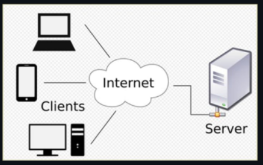

#  JavaScript Assignment 1 

## 1. Who is the founder of JavaScript and when was it founded?

Ans. Brendan Eich - 1994 

## 2.	What was the first browser, who was the founder, and when was it released?

Ans. worldwideweb[www] Tim Berner Lee - 1990

## 3. Name the two dominant browsers in the year of 2000.

      Ans. -Internet Explorer
           -Netscape Navigator
           -Java Script

## 4. What is ECMAScript?

Ans. ECMA stands for European Computer Manufacturers Association and it is introduced in 1997. ECMAScript is a standardized 
     scripting   language specification that forms the foundation of JavaScript and it is defines the core features, syntax,
     and behavior that scripting languages should follow to ensure consistency across different platforms. New version of
     javascript introduced in ECMA Script. 2025 year introduce javascript major version "ES-6".

## 5. Define syntax.

Ans. Syntax is the set of rules that has be follows while calling. Syntax refers to the rules for writing code so that a computer 
     can understand it. and simply syntax is structure or order. 

        Eg. syntax : console.log("Hallo world");

## 6. What is the difference between WorldWideWeb and World Wide Web?

Ans. **WorldWideWeb ;**

     -It is the first web browser in 1990 and is the founder Tim Berner Lee
     -It was later renamed 'Nexus' to avoid confusion
     -no spaces between the words (www)
     -it is used to access and create page
     -the first tool used to read and write books in that library.

**World Wide Web ;**

     -spaces between the words (w w w)
     -service the run on the internet
     -the entire library
     -the global system of websites
     -This is the full, official name of the system
     -It refers to the global collection of websites and web pages accessed via the internet
     -used to sharing information.

## 7. What is the NodeJS?

Ans. NodeJS is a opensource, cross platform ,javascript runtime Environment that allows developers to execute javascript outside
     the browser. it is Used for backend development and Commonly used in Building web servers and APIs, Real-time apps (chat apps, games), Backend for websites, Command-line tools.

## 8. What is V8 engine?

Ans. The V8 JavaScript engine is a high-performance engine that executes JavaScript code. It is the part of a system that 
     reads JavaScript and converts it into machine code and then computer can run. it is used Inside the Google Chrome browser
     and Inside NodeJS.

    - Fast execution : It compiles JavaScript directly into machine code
    - Efficient memory use : Manages memory automatically with garbage collection
    - Open source : Developed by Google.

## 9. What is meant by scripting languages?

Ans. A scripting language is a type of programming language that is interpreted and executed line by line.

     - Easy to write and learn
     - Quick and very fast execution
     - it is used Server-side programming
     - No separate compilation step.

        Eg. JavaScript
            Python
            PHP
            Bash

## 10. What is meant by interpreted and compiled programming languages? Give examples for each.

Ans. **interpreted**

     - interpreter language is executed line by line
     - An interpreted programming language is one in which the code is executed line by line by an interpreter, without converting 
       the entire program into machine code beforehand.

          Eg. JavaScript
              Python
              Ruby

**Compiled Programming Languages**

  - compiled program language is translated first, then executed
  - session by session execute
  - fast programming language
  - A compiled programming language is one in which the entire program is first translated into machine code by a compiler
    before execution.
  - The compiled code is then run as a separate executable file.

         Eg. C
             C++
             Java (compiled to bytecode, then executed by JVM)

      
## 11. Write short notes on alert and console.log?

Ans. **alert()**

     alert() is a built-in JavaScript function that displays a popup dialog box with a message and an OK button to the user. alert()
     is Commonly used for simple notifications or debugging.

         Eg. alert("Hello, world!");

**console.log()**

console.log() is a JavaScript function used to print messages or data to the browser’s developer console for debugging purposes.
it is helps to developers debug code by displaying values, variables, and messages.Mainly used during development, not visible to end users.

        Eg. console.log("Hello, world!");

## 12. What is the Internet? Explain in simple terms.

Ans. The Internet is a global network of computers and devices that are connected to each other and can share information. it is like a huge web
     that links millions of computers around the world, allowing people to communicate, search for information, watch videos, send emails,
     and use websites. it is shortly the Internet is a worldwide system that connects computers so they can communicate and share data. 

      - group of interconnected network (network of network)

## 13. What is networking? Why is it important?

Ans. Networking is the process of connecting two or more computers or devices so they can communicate and share information,
     resources, and services.they sharing information and all it is faster and easier.

                it is more important as, ;
                    
                         Resource sharing: Devices can share files, printers, and software.
                         Communication: Enables email, messaging, and video calls.
                         Data sharing: Makes it easy to transfer and access information.
                         Cost saving: Shared resources reduce expenses.
                         Collaboration: Helps people work together from different locations.

## 14. What is the difference between networking and the Internet?

Ans. **Networking**

     Networking is a Connecting devices (small or large scale) and Networking is the process of connecting two or more computers or devices so they can communicate and share informations.

    - Networking is the process of connecting two or more computers or devices.
    - It can be small (like within a home, school, or office).
    - Used to share resources like files, printers, and data.

           Eg. A school computer lab network.

**Internet**

  Internet is a worldwide system that connects many networks together.

  - The Internet is a global network of networks.
  - It connects millions of networks and devices worldwide.
  - Used for communication, browsing websites, email, etc.

          Eg. Accessing websites like Google or YouTube.

## 15. What is the difference between a website and a web application?

Ans. **Website**

      Information-focused, mostly static and primarly send informatio, most read only 

        - A website is a collection of web pages that provide information.
        - It is mostly static (content does not change much).
        - Users mainly read or view content.

             Eg. News sites or informational pages.

 **Web application**

A web application is application software hosted on a remote server and accessed directly through a web browser over the internet.A web application 
is software that runs in your web browser instead of being installed directly on your device. You access it through a URL using browsers like Google Chrome etc,

     - Client-side (Front-end): The interface users interact with in the browser.
     - Server-side (Back-end): Processes data, manages user requests, and stores information.
     - Communication: Interacts via HTTP protocols over the internet.

            Eg. Chrome
                youtube
                google
                instagram
                whatsapp
 
## 16. What are some examples of websites and web applications?

**Websites**
   Eg. wikipedia
       news site
       bbc news
       national geographic

**web application**
    Eg. gmail
        youtube
        facebook
        whatsapp
        amazon
        instagram

## 17. What is a server? Explain its role in web development.

Ans. A server is a computer system or software that provides data, resources, or services to other computers, called clients, over a network (usually the internet).

**Role of a Server in Web Development**

In web development, a server plays a central role in delivering websites and web applications to users.

   1.Handling Requests
   2. Serving Web Pages
   3.Running Backend Logic
   4. Database Communication
   5. Managing Security
   6. Handling Multiple Users

    •  Your browser → sends request to server 
    •  Server → processes request and fetches data 
    •  Server → sends response back to browser 
    •  Browser → displays the webpage

## 18. What is a database? Why is it used?

Ans. A database is an organized collection of data that is stored and managed in a way that allows easy access, retrieval, modification, and deletion.

     Databases are essential in applications and websites because they help manage large amounts of data efficiently. It is used to store information in a 
     structured format and Easy Retrieval the Databases allow quick searching and fetching of specific data using queries.

    •	Data Storage
    •	Easy Retrieval
    •	Data Management
    •	Data ConsistencyS
    •	Ecurity
    •	Backup and Recovery

## 19. What is the difference between a server and a database?

Ans. A server and a database are closely related in web development, but they serve different purposes.

      •  A server is a system (hardware or software) that handles requests and delivers responses to clients (like web browsers). 
      •  A database is a system that stores and manages data.

   

## 20. Explain the client-server architecture.

Ans. Client–server architecture is a model in which multiple clients (users or devices) communicate with a server to request and receive services or data over a network.
 

•  A client is a device or program that requests services or data. 
•  A server is a system that provides those services or data.

⚙️ Working Process

1.	The client sends a request to the server. 
2.	The server receives and interprets the request. 
3.	The server processes it (may access a database or perform logic). 
4.	The server returns the result to the client.

👍 Advantages

     •	Centralized control of data and resources 
     •	Easier maintenance and updates 
     •	Improved security management 
     •	Scalable for large systems 

👎 Disadvantages

     •	Server overload can slow performance 
     •	Single point of failure if the server crashes 
     •	Requires reliable network connectivity

           Eg.
                •	Web applications (browsers and web servers) 
                •	Email services 
                •	Online banking systems 
                •	Cloud services

## 21. What happens when you type a URL in a browser?

Ans. When you type a URL into a browser like Google Chrome and press Enter, a lot happens behind the scenes to load the webpage.

     [DNS lookup → Connection → Request → Server processing → Response → Rendering]

              Eg. Protocol (e.g., http or https)
                  example.com

## 22. What is a client in a client-server model?
Ans. A client in a client–server model is a device or software application that requests services or resources from a server. The client is the 
     requesting side of the system. It initiates communication and asks the server for data or services.

     Eg.
         •	Web browsers (Chrome, Firefox) 
         •	Mobile apps (WhatsApp, Instagram) 
         •	Email applications 

## 23. What is the role of a browser in accessing the web?

Ans. A browser is a software application that acts as a client to access and display content on the web. The  browser is the tool that connects you to the web,
     sends requests to servers, and turns raw data into readable web pages.

Main Functions of  Browser ;
1. Sending Requests
2. Receiving Responses
3. Rendering Web Pages
4. Handling Navigation
5. Ensuring Security
6. Managing Data

## 24. What is the difference between the Internet and the World Wide Web?

Ans. 🌐 Internet

      Internet is network of networks . The Internet is a global network of interconnected computers and devices.  it is the infrastructure (hardware + networks) and use protocols like TCP to transfer data. The Internet provide many services are ,

       •  Web (WWW) 
       •  Email 
       •  File transfer (FTP) 
       •  Online gaming, etc.

    🌍 World Wide Web (WWW)

     Web as information (pages, sites) you access using the Internet . The World Wide Web is a service that runs on the Internet and It consists of websites and web pages,
     they Use HTTP to access content and accessed through browsers like Google Chrome.

## 25. What is a web browser? Give examples.
Ans. A web browser is a software application used to access, retrieve, and display information from the World Wide Web and it is acts as a client that communicates
     with web servers using protocols like HTTP or HTTPS, and converts web data into readable web pages for users.

🌐 Examples of Web Browsers

•	Google Chrome 
•	Mozilla Firefox 
•	Microsoft Edge 
•	Apple Safari 

---

Author
AMRITHA MOHANAN

--- 