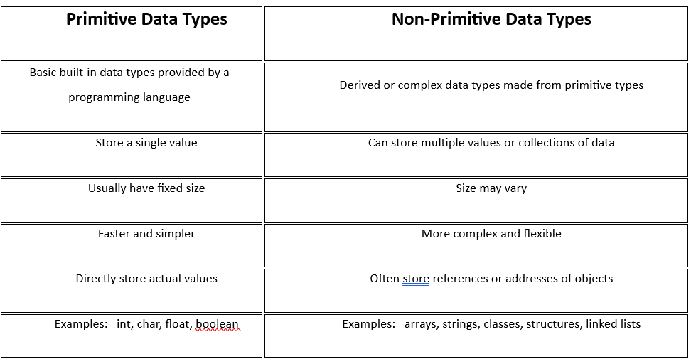

# JavaScript Assignment-02

## Section A:
---

## 1. What are data types in JavaScript?

Ans. The data type defines the kind of value a variable can hold. It tells the program what type of data you’re working with so 
     it can handle it correctly. they are mainly classified into two,

                 - primitive data type
                 - Non primitive data type

    And futher classified into different types,
         1. Primitive Data Types
            - Number 
            - String 
            - Boolean
            - Undefined
            - Symbol
            - Null
            - NaN

        2. Non-Primitive (Reference) Data Type
            - bject 
            - Array
            - Function

## 2. List all primitive data types in JavaScript?

Ans. Primitive datatype is a basic type of data built into a programming language, representing simple values that cannot
     be broken down futher.
       
       Primitive Data Types
            - Number 
            - String 
            - Boolean
            - Undefined
            - Symbol
            - Null
            - NaN

## 3. What is the difference between primitive and non-primitive data types?

Ans. The difference between primitive and non-primitive data types is mainly about how data is stored and what operations 
     can be performed on it.
         Primitive types represent single simple values.
         Non-primitive types represent groups of values or more complex entities.


---

## 4. What is the `typeof` operator? Give examples.

Ans. The typeof operator is used in JavaScript to determine the data type of a variable or value.

      Syntax : typeof value
```js
            Eg. typeof 10 // output = number
                typeof "hallo" // output = string
                typeof null // output = object
                typeof true // output = boolean
                typeof [1, 2, 3] // output = object
```

## 5. What is the `undefined` data type?

Ans. The undefined data type in JavaScript represents a variable that has been declared but has not been assigned a value. 
     It is a primitive data type. undefined datatype variable exists but has no value.

## 6. What is `null` in JavaScript?

Ans. The null is defined as explicitly assigned “no value”. In JavaScript, null is a primitive value that represents “no value” or “empty”. 
     It is intentionally assigned to a variable to indicate that it does not currently have any meaningful value.

## 7. What is the difference between `null` and `undefined`?

Ans. null is defined as explicitly assigned “no value”. In JavaScript, null is a primitive value that represents “no value” or “empty”. 
     It is intentionally assigned to a variable to indicate that it does not currently have any meaningful value.
     And, 
     undefined means The undefined data type in JavaScript represents a variable that has been declared but has not been assigned a value. 
     It is a primitive data type. undefined datatype variable exists but has no value.


---

## 8. What is the `boolean` data type? Give examples.

Ans. The boolean data type is a data type that can only hold one of two possible values: true or false. It’s used in programming 
     to represent logical values, such as yes/no, on/off, or conditions that are either satisfied or not.

            Characteristics of Booleans;
                 Only two possible values: true or false.
                 Often used in conditional statements (like if statements) and loops to control program flow.
                 In many programming languages, booleans can also result from comparisons. 
``` js   
     Eg. let a=5
         let b=10
         console.log(a>b)  // output = false 
```

## 9. What is a `string` in JavaScript? 

Ans. String is a data type used to represent text—a sequence of characters. Characters can include letters, numbers,
     symbols, spaces, or even emojis. And string as anything enclosed in quotes. Strings are immutable in JavaScript.

``` js
            Eg. let firstName = "ammu";
                let lastName = "amz";
                let fullName = firstName + " " + lastName;
                console.log(fullName);                          // Output = ammu amz
```

## 10. What is a `number` data type? Does JavaScript support integers and floats separately?

Ans. The number data type in JavaScript is used to represent both integer and floating-point numbers.  
     JavaScript does not distinguish between integers and floats internally—they are all of type number.

---
## Section B:

---

## 11. What is the `symbol` data type in JavaScript?

Ans. A symbol is a unique and immutable primitive value, mainly used as an identifier for object properties.
     No two symbols are the same, even if they have the same description.

## 12. What is `bigint` and why is it used?

Ans. BigInt is a primitive data type in JavaScript used to represent integers that are too large for the regular
     number type. It’s used when normal `number` cannot safely represent very large integers.

## 13. What happens when you use `typeof null`?

Ans. Null is a primitive value in JavaScript that represents “no value” or “empty reference”.
     However, due to a bug in the original JavaScript implementation, typeof null returns "object", even though null is not actually an object.
     This has been kept for backward compatibility, so it is unlikely to change.

## 14. Explain type coercion with examples

Ans. Type coercion is when JavaScript automatically converts one data type to another.

```js
console.log("5" + 2);           // "52" (number 2 converted to string)
console.log("5" - 2);           // 3   (string "5" converted to number)
```

## 15. What is implicit and explicit type conversion?

Ans. Implicit conversion (type coercion): JavaScript automatically converts types.

```js
let result = "10" * 2; // 20 (string converted to number)
```

Explicit conversion Programmer manually converts types using functions.

```js
let str = "123";
let num = Number(str); // 123
```


---

## 16. What is `NaN`? When does it occur?

Ans. NaN stands for Not-a-Number. It occurs when a mathematical operation fails to produce a valid number.

```js
console.log("hello" - 5); // NaN
console.log(typeof NaN);  // "number"
```
---
## Section C:

---

## 17. Write a program to check the data type of a variable

Ans. 
```js
     let x = 42;
     console.log(typeof x); // output = number
```

## 18. Declare variables of all primitive data types and print their types

Ans.
```js
let num = 10;
let str = "Hello";
let bool = true;
let und = undefined;
let nul = null;
let sym = Symbol('id');
let bigIntNum = 12345678901234567890n;

console.log(typeof num);                 //       "number"
console.log(typeof str);                 //       "string"
console.log(typeof bool);                //       "boolean"
console.log(typeof und);                 //       "undefined"
console.log(typeof nul);                 //       "object"
console.log(typeof sym);                 //       "symbol"
console.log(typeof bigIntNum);           //       "bigint"
```

## 19. Convert a string to a number

Ans. 
```js
let str = "123";
let num = Number(str);
console.log(num);             // 123
console.log(typeof num);      // number
```

## 20. Convert a number to a string

```js
let num = 456;
let str = String(num);
console.log(str);              // 456
console.log(typeof str);      // string
```

## 21. What will be the output?

    1. console.log(typeof 42);        
    2. console.log(typeof "Hello");   
    3. console.log(typeof true);      
    4. console.log(typeof undefined); 
    5. console.log(typeof null);      

Ans. 
      1. number 
      2. string
      3. boolean
      4. undefined
      5. object

## 22. Predict the output

    a. console.log(5 + "5");     
    b. console.log("5" - 2);     
    c. console.log(true + 1);    
    d. console.log(false + "hello"); 

Ans. 
     a. 55 - convert to string
     b. 3 - string converted to number
     c. 2 - true treated as 1
     d. falsehello - converted to string

## 23. Create an object and an array, then check their data types

Ans. 
```js
let obj = { name: "Ammu" };
let arr = [1, 2, 3];

console.log(typeof obj);         //  output = "object"
console.log(typeof arr);        // output = "object"
```
---
## Section D:

---

## 24. Can a variable change its data type? Explain with example

Ans. Yes, JavaScript is dynamically typed, so a variable can hold values of different types over time.

```js
let value = 10;                   // Number
console.log(typeof value);

value = "Hello";                  // String
console.log(typeof value);

value = true;                     // Boolean
console.log(typeof value);

value = { name: "Sam" };          // Object
console.log(typeof value);
```


## 25. How does JavaScript handle large integers?

Ans. JavaScript uses the IEEE-754 double-precision floating-point format for its regular Number type. That means 
     integers are only represented exactly up to a certain size. they use BigInt for arbitrarily large integers, JavaScript provides
     The maximum safe integer is: (2^53-1=9007199254740991).

```js
let bigNum = 9007199254740993n;          // beyond Number.MAX_SAFE_INTEGER
console.log(bigNum + 1n);                // works safely
```

---

Author
   AMRITHA MOHANAN.

---


