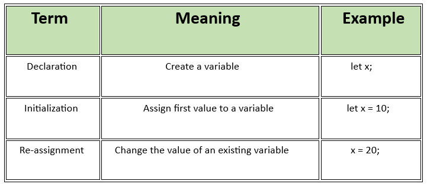

# JavaScript Assignment – 03
---

## Section A: 

## 1. What is a variable in JavaScript?

Ans.  A variable in JavaScript is a container used to store data values. It can hold different types of data such as numbers,
      strings, booleans, arrays, objects, etc. Variables allow you to reference and manipulate data throughout your program.

## 2. What is the difference between declaration, initialization, and re-assignment?

Ans. Declaration means Creating a variable using let, var, or const. This is when you create a variable in memory.
     At this stage, the variable exists but doesn’t yet have a value (unless you initialize it at the same time).
        
         Example:  
```js
                   let age;
```

Initialization means Assigning a value to a variable for the first time. This is when you give a variable its first value.
You can do this at the time of declaration or later.
         
         Example:

  ```js
                  let  age = 25;
  ```

Re-assignment is Changing the value of an already initialized variable. This is when you change the value of an existing variable.
Only variables declared with let or var can be re-assigned (not const).
          
          Example:

  ```js
                    age = 30;
  ```

---


## 3. What are `let`, `var`, and `const`? What is the difference between them?

Ans. var - Function-scoped, can be re-declared and updated. allowed the re-assignment and Variables are hoisted and initialized with undefined.

     let - Block-scoped, can be updated but not re-declared in the same scope. Not allowed Re-declaration in the same scope ans Re-assignment 
           is allowed. Variables are hoisted but not initialized, so using before declaration causes an error.

     const - Block-scoped, cannot be updated or re-declared; must be initialized during declaration. Re-declaration is not allowed in the 
             same scope and Re-assignment are Not allowed, The value must be assigned during declaration. Hoisting Same as let, cannot access before declaration.


---


## 4. Create a greeting alert

Ans.
```js
let name = prompt("Enter your name:");
let message = "Hallo, " + name + "! Welcome!";
alert(message);
```

## 5. What are the naming conventions in JavaScript?

Ans.
* Variable names should be meaningful.
* Use camelCase for variable and function names.      Eg: firstName, totalAmount.
* Cannot start with a number.
* Can contain letters, digits, underscores '_', or dollar signs '$'.
* Avoid using JavaScript reserved keywords.
---
## Section B:

## 6. Create variables for age, city, and isStudent. Print them in one sentence.

Ans.
```js
let age = 21;
let city = "uk";
let isStudent = true;

console.log(`I am ${age} years old, live in ${city}, and it is ${isStudent} that I am a student.`);
```

## 7. Swap the values of two variables using a temp variable

Ans.
```js
let x = 11;
let y = 5;

let temp = x;
x = y;
y = temp;

console.log(`x = ${x},
             y = ${y}`);          //    x = 5, y = 11
```

## 8. Change a variable from number to string and print both values

Ans.
```js
let num = 42;
console.log(typeof num, num);           // number 42

num = String(num);
console.log(typeof num, num);           // string "42"
```

## 9. Combine firstName and lastName using template literals

Ans.
```js
let firstName = "Amritha";
let lastName = "Mohanan";

let fullName = `${firstName} ${lastName}`;
console.log(fullName);                             //   output = Amritha Mohanan
```

## 10. Identify valid and invalid variable names

Ans.
**Valid:**

```js
let name;
let $price;
let _totalAmount;
let age1;
```

**Invalid:**

```js
let 1name;             // starts with a number
let first-name;        // contains hyphen
let var;               // reserved keyword
```
---

Author
AMRITHA MOHANAN

---