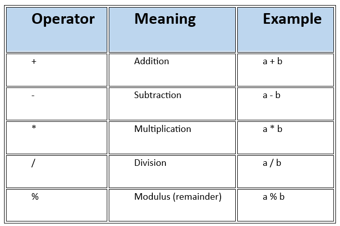

# JavaScript  Assignment – 04 [operators]
---

## Section A:

## 1.	What are operators in JavaScript?
 
  Ans. Operators are symbols that perform operations on values (operands). 
       they are classified into different types,
       
           1. Arithmetic Operators
           2. Assignment Operators
           3. Comparison Operators
           4. Logical Operators
           5. String Operators
           6. Conditional (Ternary) Operator
           7. Type Operators
           8. Bitwise Operators
           9. Other Operators

## 2. What is the difference between arithmetic operators and assignment operators? 

Ans. - **Arithmetic operators** perform mathematical operations, it is used to perform mathematical calculations on values or variables. 
       
        -  `+`, `-`, `*`, `/`, `%`. 


---

```js
        Eg. a = 10
            b = 5
            print(a + b)         // 15
            print(a * b)         // 50 
```

- **Assignment operators** assign values to variables, 
    
          -  `=`, `+=`, `-=`, `*=`, `/=`.


---

```js
      Eg.  a = 10
           a += 5            // same as a = a + 5
           print(a)          // 15
```
---


---

## 3. Explain the purpose of comparison operators with examples.  

Ans.  **Comparison operators** are used to compare values and return `true` or `false`.  

Eg.
   ```js
   5 > 3            // true
   5 < 3            // false
   5 == 5           // true
   5 != 3           // true
```

## 4. What is the difference between `==` and `===` in JavaScript?

Ans.   **== (Loose Equality Operator)**

       `==` checks value equality (performs type coercion). compares values only after performing type conversion if needed.

**=== (Strict Equality Operator)**

       `===` checks value and type equality (strict equality). Compares both value data type, No type conversion happens.

Eg.
   ```js
   10 == "10"          // true
   10 === "10"         // false
   ```


## 5. What is the difference between `!=` and `!==`?

Ans.  `!=` checks inequality of values (with type coercion).

`!==` checks inequality of value or type (strict inequality).

Eg.
   ```js
   10 != "10"  // false
   10 !== "10" // true
   ```

## 6. What are logical operators? Explain `&&`, `||`, and `!`.

Ans. Logical operators are used to perform logical operations, combine or invert boolean values:

   * `&&` (AND): true if both operands are true.
   * `||` (OR): true if at least one operand is true.
   * `!` (NOT): inverts the boolean value.

Eg.
  ```js
   true && false // false
   true || false // true
   !true        // false
   ```

## 7. What is the purpose of the modulus (%) operator?

Ans. Returns the remainder of a division.

Eg.
   ```js
   10 % 3         // 1 (remainder)
   ```

## 8. What is the increment operator? Explain pre-increment and post-increment.

Ans. The increment operator (`++`) increases a number by 1.

   * **Pre-increment (`++x`)**: increments first, then returns the value.
   * **Post-increment (`x++`)**: returns the value first, then increments.

## 9.What is the decrement operator?

Ans. The decrement operator (`--`) decreases a number by 1.

## 10. What is operator precedence in JavaScript?

Ans. Operator precedence determines the order in which operators are evaluated in expressions. For example, `*` has higher precedence
     than `+`.

---

## Section B:
---

## 11. predict the output of the following program.

Ans.
 ```js
 
let a = 10;                        // - outputs 
let b = 3;
console.log(a + b);                //   13
console.log(a - b);                //   7
console.log(a * b);                //   30
console.log(a / b);                //   3.3333333333333335
console.log(a % b);                //   1

````
---
## 12. predict the output of the following program.

Ans.
````js
let x = 5;
console.log(x++);           // 5 (post-increment)
console.log(x);             //   output = 6
````

## 13. predict the output of the following program.

Ans.
````js
let x = 5;
console.log(++x);          // 6 (pre-increment)
console.log(x);            //   output = 6

````

## 14. predict the output of the following program.

Ans.
````js
console.log(10 == "10");              //     true
console.log(10 === "10");            //      false
````

## 15. predict the output of the following program.

Ans.
````js
console.log(true && false);           // false
console.log(true || false);           // true
console.log(!true);                   // false

````

## 16. predict the output of the following program.

Ans.
````js
let a = 8;
a += 2;                                // a = 10
a *= 3;                                // a = 30
console.log(a);                        // 30
````

## 17. predict the output of the following program.

Ans.
 ````js
console.log(5 > 3 && 10 < 20);              // true
console.log(5 > 10 || 8 == 8);              // true

````

## 18. predict the output of the following program.

Ans.
 ````js
console.log(10 + "5");           // "105" (string concatenation)
console.log("10" - 5);           // 5   (string converted to number)
````

---

## Section c: 
---

## 19. Add two numbers and display result.

```js
let a = 5;
let b = 2;
let sum = a + b;
console.log(sum);   //   output = 7
```

## 20. Calculate area of a rectangle.

```js
let length = 10;
let breadth = 5;
let area = length * breadth;
console.log(area);            //     output = 50
```

## 21. Swap two numbers using a third variable.

Ans.
```js
let a = 10
let b = 6
let temp = b 
b = a 
a = temp
console.log(a);
console.log(b);       //       output =    a=6
                      //                   b=10
```

## 22. Swap two numbers without a third variable.

Ans.
```js
let a = 15
let b = 5
a = a+b        // (a=a+b , 15+5=20 -> "a=20")
b = a-b        // (b=a-b , 20-5=15 -> "b=15")
a = a-b        // (a=a-b , 20-15=5 -> "a=5")
console.log(a);
console.log(b);     //     output =   a=3
                    //                b=5

```

## 23. Calculate annual interest

Ans.
```js
let P = 1000
R = 5
T = 2
let I = (P * R * T) / 100;
console.log("Annual Interest:", I);      //      output  =  Annual Interest: 100
```

## 24. Convert Fahrenheit to Celsius.

Ans.
```js
let F = 100;
let C = ((F - 32) * 5) / 9;
console.log("Celsius:", C);                   //       output   =   Celsius: 37.77777777777778
```

## 25. BMI Calculator.

Ans.
```js
let weight = 70;                             // kg
let height = 1.75;                           // meters
let BMI = weight / (height * height);
console.log("BMI:", BMI);                //     output  =     BMI: 22.857142857142858                        
```

## 26. Discount Percentage Calculator

Ans.
```js
let MRP = 500
sellingPrice = 400
let discountPercentage = ((MRP - sellingPrice) * 100) / MRP;
console.log("Discount Percentage:", discountPercentage + "%");        //     output  =  Discount Percentage: 20%
```

---

## Section D:

## 27. Explain type coercion in JavaScript with examples.

Ans. Type coercion is the automatic conversion of values from one type to another. Authorwise Type coercion is when JavaScript automatically 
     converts a value from one data type to another. This happens because JavaScript is a loosely typed language, meaning it doesn’t strictly require variables to have a specific type.

There are two main kinds of coercion:

        1. Implicit coercion – JavaScript automatically converts types for you.
        2. Explicit coercion – You manually convert types using functions or operators.

```js
console.log("5" + 2);                  //        "52" (number to string)
console.log("5" - 2);                  //         3   (string to number)
```

## 28. Why does `"5" + 2` produce a different result from `"5" - 2`?

Ans.
* `+` with a string concatenates.
* `-` converts string to number and subtracts.

## 29. What is short-circuit evaluation in logical operators?

Ans. Short-circuiting stops evaluation as soon as the result is determined. Short-circuit evaluation occurs when JavaScript stops 
     evaluating a logical expression as soon as the result is determined, without checking the rest of the expression.

* `&&` stops if first operand is false.
* `||` stops if first operand is true.

## 30. Predict the output of the following program. 

Ans. 
```js
      console.log(true + true);      //        2   (true is 1)
      console.log(false + 1);       //         1   (false is 0)

```

## 31. Explain truthy and falsy values in JavaScript. 

Ans.
- **Truthy:** values that evaluate to true in boolean context (`1`, `"hello"`, `[]`, `{}`). 

- **Falsy:** values that evaluate to false (`0`, `""`, `null`, `undefined`, `NaN`, `false`).

```

---

Author
AMRITHA MOHANAN

---
